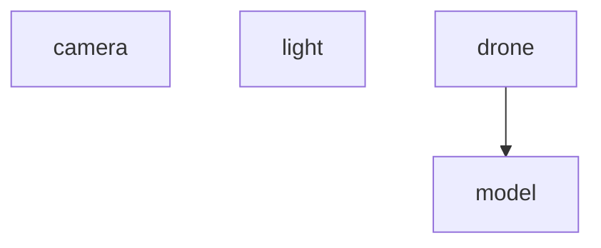

# NOTE PROGETTO

## abstract

create a 3D environment where a the user can move the drone model around

- controls with wasd and on screen
- responsive css for mobile

## Project design

## Domain Model

The domain model is composed by the following subclasses




The scene is updated by changing the parmeters of the object in the model, this is done by the control classes in an async paradigm

```mermaid
sequenceDiagram
participant graphic_pipeline
participant drone
participant keyboard
user ->> keyboard: recives input from user
keyboard->> drone: updates geometric parameters (rotation,position) according to logic
graphic_pipeline: renders the scene
```

