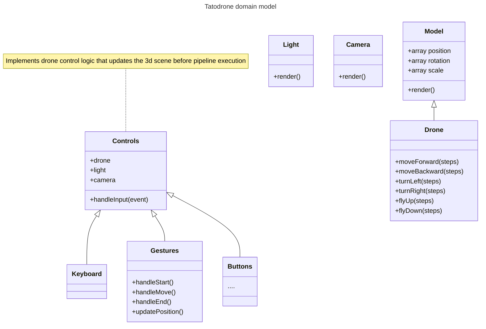

# TATODRONE

## IDEA

Realizzare un ambiente 3D in cui un drone potesse muoversi all'interno di una mappa e raccogliere oggetti.

## DEPLOYMENT

sono previste diverse modalita di deployment a seconda delle situazioni di esecuzione (docker e quella maggiormente supportata e in cui e stato/viene effettuato lo sviluppo):

- docker container, in questa modalita l'applicazione e servita per mezzo di un container docker, e possibile utilizzare un docker compose file come segue:

> assumendo che il docker compose si trovi nella cartella `project`
```yaml
---
services:
  drone:
    image: httpd:2.4
    ports:
      - "8080:80"
    volumes:
      - "./:/usr/local/apache2/htdocs/"
```

In questa modalita viene utilizzata l'immagine di default di `apache2` per servire i file presenti nella directory (*questa modalita funge anche da environment di sviluppo*)

- installazione da sorgenti, in questa modalita l'applicazione viene servita da un webserver installato sulla macchina di esecuzione:

```bash
# presumendo di aver installato un webserver funzionante e che la cartella di servizio del webserver sia /var/www (notare che per questa directory servono i permessi di root)
cp project/* /var/www/
```

la configurazione del webserver risulta come segue (*si lascia apache2 come esempio, non dovrebbe differire con altri webserver*)

```apache2
<VirtualHost *:80>
DocumentRoot /var/www/
ErrorLog ${APACHE LOG DIR}/error.log
CustomLog ${APACHE LOG DIR}/access.log combined
```

E inoltre attiva una live demo costantemente aggiornata a questo [indirizzo](https://tatodrone.carnivuth.org)

## ANALISI

### GAP TECNOLOGICO

I requisiti richidono un implementazione della pipeline di rendering grafico per mezzo delle api webgl, questo pone una sfida importante nel cercare di appianare il gap tecnologico tra i requisiti applicativi e la api di basso livello offerta dallo strumento

```
-------------
|application|
-------------
    |
    |
    |
----------------
|high level api|
----------------
    |
    |
    |
    |
-------
|webgl|
-------
```
Il componente software centrale deve sfruttare l'API webGL per effettuare il rendering grafico di elementi comandati dall'applicazione (*luci, oggetti tridimensionali, camera*), senza esporre dettagli implementativi di basso livello (*allocazione di buffer nella gpu,gestione di flag webgl, canvas management ecc..*)

### CONTROLLI

I requisiti richiedono inoltre la gestione di multipli sistemi di interazione con l'applicazione stessa, a cui i browser forniscono differenti interfacce logiche di accesso di basso livello (*accessibili per mezzo di callback functions*), per esempio l'interfaccia per intercettare l'input con schermi touch e differente da quella per la ricezione dell'input da tastiera

Tuttavia le azioni che i differenti sistemi di input consentono all'utente risultano le stesse (tutti i sistemi di controllo consentono gli stessi movimenti del drone), questo porta a una scomposizione del problema in due azioni distinte

- intercettazione dell'input dal sistema di controllo
- esecuzione delle azioni sul modello del dominio in base a quanto ricevuto in input dal sistema di controllo

Inoltre i sistemi di input devono essere intercambiabili dinamicamente (il passaggio da un sistema di input a un altro non deve richiedere altre interazioni all'utente se non l'interazione con il nuovo sistema di input)

### MODELLO DEL DOMINIO

Il modello del dominio risulta come segue (*si evidenziano solo le classi e componenti principali per semplicita*)



