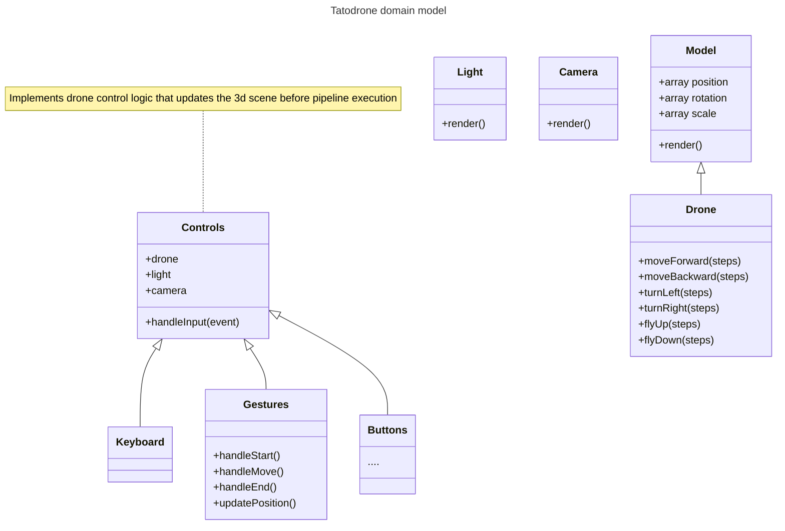
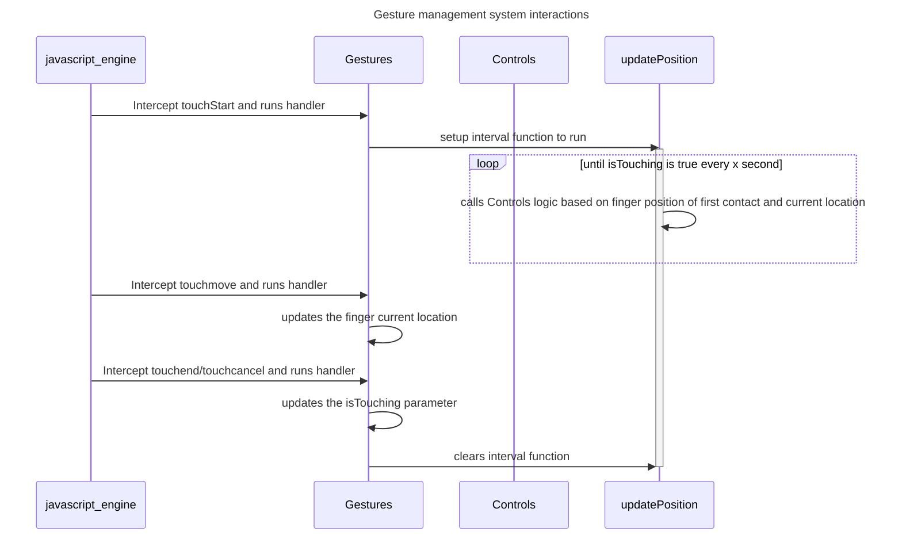

# TATODRONE

## IDEA

Realizzare un ambiente 3D in cui un drone potesse muoversi all'interno di una mappa e raccogliere oggetti.

## DEPLOYMENT

sono previste diverse modalita di deployment a seconda delle situazioni di esecuzione (docker e quella maggiormente supportata e in cui e stato/viene effettuato lo sviluppo):

- docker container, in questa modalita l'applicazione e servita per mezzo di un container docker, e possibile utilizzare un docker compose file come segue:

> assumendo che il docker compose si trovi nella cartella `project`
```yaml
---
services:
  drone:
    image: httpd:2.4
    ports:
      - "8080:80"
    volumes:
      - "./:/usr/local/apache2/htdocs/"
```

In questa modalita viene utilizzata l'immagine di default di `apache2` per servire i file presenti nella directory (*questa modalita funge anche da environment di sviluppo*)

- installazione da sorgenti, in questa modalita l'applicazione viene servita da un webserver installato sulla macchina di esecuzione:

```bash
# presumendo di aver installato un webserver funzionante e che la cartella di servizio del webserver sia /var/www (notare che per questa directory servono i permessi di root)
cp project/* /var/www/
```

la configurazione del webserver risulta come segue (*si lascia apache2 come esempio, non dovrebbe differire con altri webserver*)

```apache2
<VirtualHost *:80>
DocumentRoot /var/www/
ErrorLog ${APACHE LOG DIR}/error.log
CustomLog ${APACHE LOG DIR}/access.log combined
```

E inoltre attiva una live demo costantemente aggiornata a questo [indirizzo](https://tatodrone.carnivuth.org)

## ANALISI

### GAP TECNOLOGICO

I requisiti richidono un implementazione della pipeline di rendering grafico per mezzo delle api webgl, questo pone una sfida importante nel cercare di appianare il gap tecnologico tra i requisiti applicativi e la api di basso livello offerta dallo strumento

```
-------------
|application|
-------------
    |
    |
    |
----------------
|high level api|
----------------
    |
    |
    |
    |
-------
|webgl|
-------
```
Il componente software centrale deve sfruttare l'API webGL per effettuare il rendering grafico di elementi comandati dall'applicazione (*luci, oggetti tridimensionali, camera*), senza esporre dettagli implementativi di basso livello (*allocazione di buffer nella gpu,gestione di flag webgl, canvas management ecc..*)

### CONTROLLI

I requisiti richiedono inoltre la gestione di multipli sistemi di interazione con l'applicazione stessa, a cui i browser forniscono differenti interfacce logiche di accesso di basso livello (*accessibili per mezzo di callback functions*), per esempio l'interfaccia per intercettare l'input con schermi touch e differente da quella per la ricezione dell'input da tastiera

Tuttavia le azioni che i differenti sistemi di input consentono all'utente risultano le stesse (tutti i sistemi di controllo consentono gli stessi movimenti del drone), questo porta a una scomposizione del problema in due azioni distinte

- intercettazione dell'input dal sistema di controllo
- esecuzione delle azioni sul modello del dominio in base a quanto ricevuto in input dal sistema di controllo

Inoltre i sistemi di input devono essere intercambiabili dinamicamente (il passaggio da un sistema di input a un altro non deve richiedere altre interazioni all'utente se non l'interazione con il nuovo sistema di input)

### MODELLO DEL DOMINIO

Il modello del dominio risulta come segue (*si evidenziano solo le classi e componenti principali per semplicita*)



### RISOLVERE IL GAP TECNOLOGICO

La classe `Model` implementa la risoluzione della pipeline grafica, dato il path a un file in formato obj si occupa di effettuare il caricamento delle sue componenti all'interno di opportuni buffer e ne effettua il rendering, offre inoltre diversi metodi di utilita per la gestione della rotazione scala e posizione di un modello.

La classe `Drone` estende la classe model aggiungendo funzionalita logiche di alto livello per la manipolazione della scena nel render loop

Le classi `Camera` e `Light` gestiscono i parametri della camera e della luce rispettivamente

### GESTIRE IL MOVIMENTO

Il drone viene controllato secondo le seguenti primitive:

- muovi in avanti: muove il drone nella direzione avanti
- muovi indietro: muove il drone nella direzione indietro
- gira a sinistra: muove il drone nella direzione indietro
- gira a destra: muove il drone nella direzione indietro
- muovi verso l'alto: muove il drone verso l'alto
- muovi verso il basso: muove il drone verso il basso

Il problema sorge nel riconoscere, data la posizione del drone quale sia la direzione "avanti", per risolvere dato problema viene introdotto un punto nello spazio la cui differenza con il punto che simboleggia la posizione dello spazio restituisca la direzione avanti

```javascript
// ^
// |
// |
// |    ^    *--> forwardPosition (aka trasformed forwardVector)
// |   /
// |  /    *--> drone
// | /
// |/
// ---------------------->
```

In questo modo si e sempre in grado di computare la posizione successiva del drone, spostandolo secondo il vettore `forwardPosition - drone.position`

Il nuovo punto introdotto subisce le stesse trasformazioni fondamentali del drone (*scala,rotazione traslazione*) in modo da fornire sempre il vettore differenza corretto

### CONTROLLI

Come esplicato in analisi la gestione del controllo risulta una sfida per niente banale, seguendo il concetto introdotto in precendenza, la classe `Controls` implementa la logica di aggiornamento della posizione e rotazione del drone a partire da una stringa input simbolica generata dalle classi che la specializzano per ogni tipologia differente di controllo

Particolare e il caso della gestione del tocco, l'interfaccia fornita dai browser consente di intercettare l'input i 3 momenti distinti

- `touchstart` evento emesso quando il dito viene appoggiato sullo schermo
- `touchend` evento emesso quando il dito viene sollevato dallo schermo
- `touchmove` evento emesso quando il dito si sposta sullo schermo

Tuttavia la classe `Controls` e pensata per gestire interazioni istantanee come l'input tastiera dove la pressione del tasto genera una e una sola modifica della scena tridimensionale (l'azione dell'utente non perdura nel tempo), Mentre l'input fornito dal tocco perdura nel tempo e l'utente si aspetta un interazione proporzionale al movimento del dito sullo schermo (*se effettuo uno swipe verticale e mantengo il contatto con lo schermo mi aspetto che il drone si muova fino a che non sollevo il dito*)

Il tutto risulta in un missmatch tra l'api del browser e il tipo di evento che l'applicazione intende intercettare, e necessario di conseguenza colmare il gap con un opportuna infrastruttura



